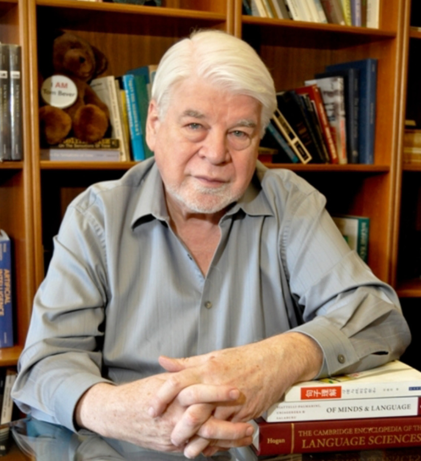

The Bever Language and Cognition Laboratory
-------------------------------------------

### University of Arizona Cognitive Science Program, Department of Linguistics, Department of Psychology

My research has two primary directions, applied and theoretical. While
they tend to support and enrich each other and there is some overlap in
actual paradigms, I present them separately because of the difference in
their implications. Students or others interested in more details should
write me at tgb@u.arizona.edu for a full description of current
projects.

### Theoretical Linguistics and Psychology

The engine underlying much of my theoretical research is the perennial
question: What is the source of linguistic universals? This is critical
to the study of grammar, since we do not want to impute to grammar
universals that have other sources.

It has lead me into detailed analysis of topics superficially distant
from linguistics: the bases for cerebral asymmetries in humans and
animals, the nature of adult performance systems, the fundamental laws
of learning abstract systems in humans and animals, group differences in
cognitive processes (e.g., based on gender, or handedness), the nature
of visual computational processes that comprise the evolved biological
substrate for language, the formal (uncaused) components of abstract
knowledge.

The unifying thread of all this is the attempt to distill out the true
linguistic universals.

### Applied Linguistics and Cognitive Science

The general goal of my applied work is: the application of linguistics
and cognitive science to improve the human use of language. Many of the
insights from recent linguistics, psycholinguistics and cognitive
science offer useful engineering solutions to practical problems.
