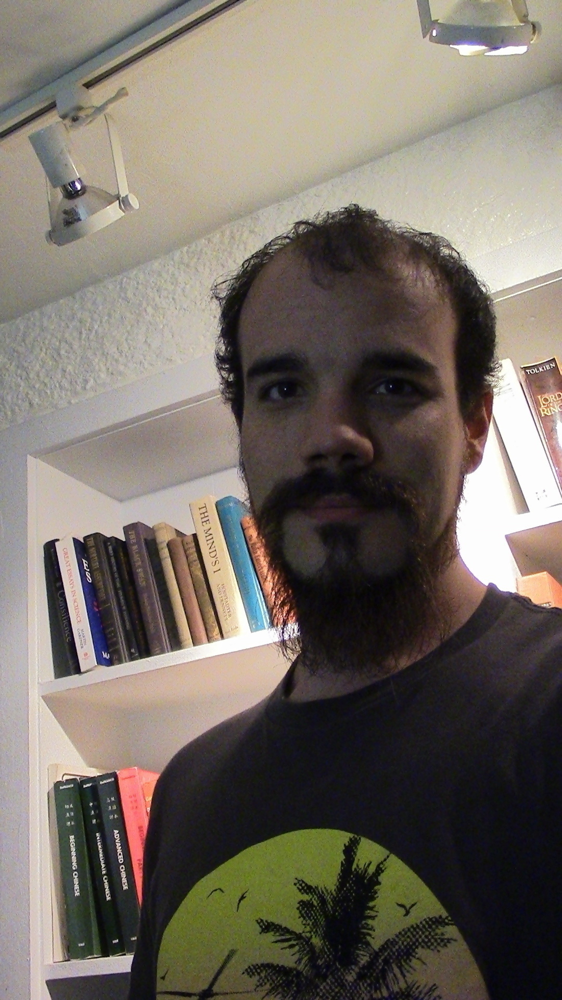

# Luke Smith

[Personal website.](http://lukesmith.xyz)

[luke@lukesmith.xyz](mailto:luke@lukesmith.xyz)

Focuses: **Neural optimization** -- **Prosodic syntax** -- **Game Theory**

Luke works on motivating language properites and alternations traditionally ascribed to syntax with language-external principles, pragmatics and prosody. The goal is to strip the theoretical structure of the language faculty to as small as possible, and understand what causes cause individual languages to vary.
