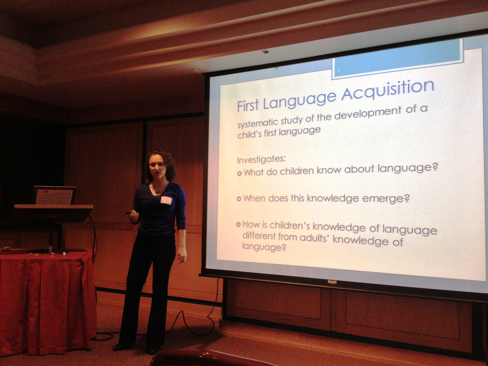

# Rachel Brown's research

[Personal Website](http://www.rachelbrownlinguistics.com/) 

Rachel’s project examines the interaction between context, meaning and linguistic structure during sentence processing using behavioral (reaction times or keyboard responses) and neurological methods (EEG).  Specifically, she is working on how contextual information influences the reading of ambiguous multi-word phrases like \*mechanical pencil eraser \*(“eraser from a mechanical pencil” or “pencil eraser that is mechanical”). These phrases differ on whether they include words referring to living beings (e.g., \*mechanical pencil eraser\* vs \*clever lizard tail\*) and whether they have a preferred interpretation (“tail of a clever lizard” is preferred over “lizard tail that is clever”). She is testing whether the reading times and EEG signals differ in response to different ambiguous phrases. Examining these stimuli will help answer:

-   When are different types of information used and how independent are
    they?
-   What processes do EEG brain signals reflect during language
    processing?
-   How does Animacy interact with context during language processing?

Students working with Rachel would help create and test potential stimuli, collect data with English native speakers using behavioral and neurological methods (including EEG), and share the results. They will learn about the linguistic properties of ambiguous phrases and the cognitive and neurological processing of language. Additionally, they would learn how to use language corpora to develop stimuli, collect data using EEG and behavioral methods, and gain experience presenting scientific research to both academic and general audiences. They will also have the opportunity to work with the Cognitive Neuroscience of Language Lab led by Dr. Tzuyin Lai in the Psychology Department. Native speakers of English and those with linguistic background are preferred.
