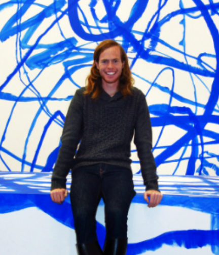

# Stanley Donahoo

Stanley Donahoo’s research is broadly concerned with how language is
represented in the mind/brain, and how this process is informed by
social meaning. As such, Stanley is currently working on the
comprehension mechanisms of swearing. This project employs both
behavioural (reaction times, computer keyboard responses) and EEG
methods. Currently, the project examines how our understanding of swears
and other taboo language unfolds at the lexical level, but the project
will be extended to sentence-level phenomena as well.

Current theories of language processing have neglected to consider how
these words are represented and processed, but we have evidence from
clinical populations to suggest that swearing is possibly processed in
the brain’s right hemisphere, while ‘normal’ language is typically a
left-hemisphere process. Why would this be the case? What ramifications
does this have for models of language comprehension? Stanley’s work
hopes to answer these and other questions by comparing this clinical
data to healthy adults. Together then, we can develop new interventions
to hasten the language recovery process in cases of stroke or aphasia.

Further, and somewhat puzzlingly, it has been claimed that many of the
mechanisms behind swearing are similar to those involved in the
understanding of discourse particles. German has many of these. For
example, \*nur\* can serve to mark questions as rhetorical. If a German
speaker asks \*Wo hast du meine Schl\*\*üssel hingelegt? \*\[Where did
you put my keys?\] the speaker is seeking a specific location as an
answer. However,\* Wo hast du nur meine Schl\*\*üssel hingelegt?\*
\[Where in the world did you put my keys, I’ve already looked
everywhere?!\] has a very different meaning. Stanley is planning to
explore these two cases, and others like it (e.g. honorifics), to have a
more complete understanding of what happens when speakers infer beyond
the literal meaning of an utterance.

Interested students would have the opportunity to help create stimuli,
write experimental scripts, and collect data by scheduling/running
participants. Students may also have the opportunity to prepare EEG data
for further analyses. Students with a general understanding of
experimental design are especially encouraged to contact the
coglanglab/Tom/Luke/stanley directly. A background in linguistics and/or
German is preferred, but certainly not required.

-stanley
